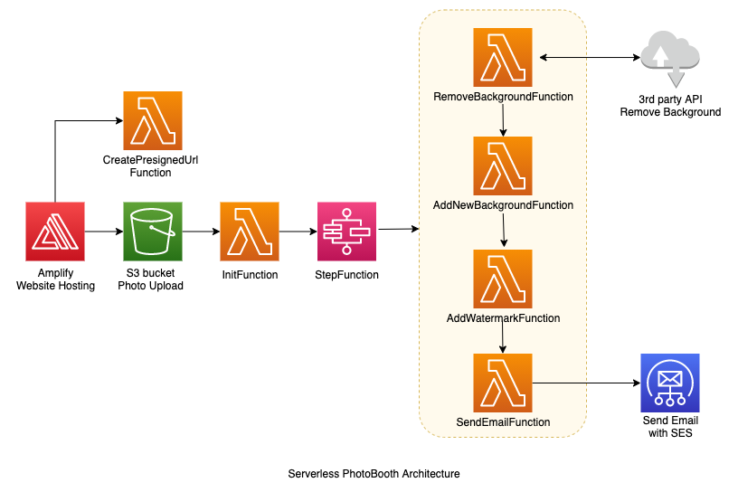

# Serverless PhotoBooth with AWS
## Using AWS Lambda, Step Functions, API Gateway, S3, SES, Amplify website hosting and deploy with Serverless Framework

This repository contains all the source code and resources needed to deploy Serverless Photobooth service described in [this blog post](https://dev.to/pubudusj).

Architecture is as follows:



## Prerequisites

* AWS cli
* [Serverless Framework](https://www.serverless.com/) cli
* yarn & jq installed
* Create a free account at [remove.bg](https://www.remove.bg/api) and generate a API token.
* Set up and verified SES send email address

## How to install
1. Clone the repository

2. Copy `.env.example` to `.env` and fill in with the appropriate values.

3. Run 
```
make install && make deploy
```
This will create the backend stack and make the frontend deployment bundle ready.

#### Frontend

3. Once step 2 above is finished, you can deploy the frontend code in `frontend/dist/frontend.zip` easily with Amplify web hosting.

4. If you need to run the frontend in local, navigate to frontend directory and run `yarn run serve`

## Delete the stack

1. To remove the backend, run `make down`.

** Make sure the s3 directory created in the stack is empty before run this command.

## More info

More information regarding the project can be found in [this blog post](https://dev.to/pubudusj).
